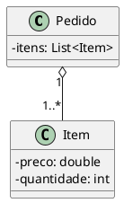
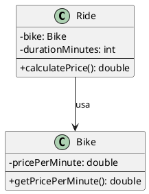
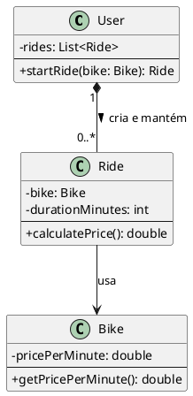
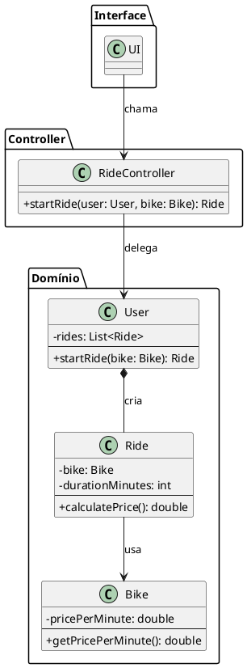
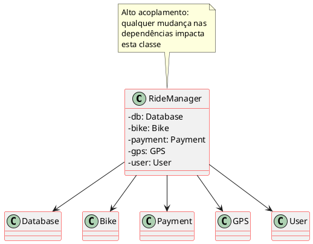
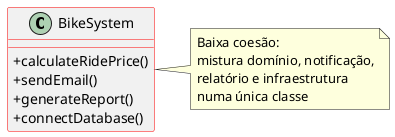

# Padrões GRASP — Primeiros princípios de atribuição de responsabilidades

**Objetivo da aula:** Entender como decidir qual classe deve fazer o quê em sistemas orientados a objetos.

---

## Parte I — Introdução

Hoje estudaremos os padrões GRASP.

**GRASP** = *General Responsibility Assignment Software Patterns*

São padrões que ajudam a responder uma pergunta fundamental de design: **"Quem deve fazer o quê dentro de um sistema?"**

Considere o seguinte modelo parcial:



Quem deve calcular o total de uma compra — `Pedido`, `Item`, ou uma terceira classe? Esse tipo de decisão é exatamente o que os padrões GRASP nos ajudam a tomar.

---

## Parte II — Information Expert

> **Princípio:** Atribua uma responsabilidade à classe que possui as informações necessárias para realizá-la.

Em linguagem simples: *deixe na mão de quem sabe.*

### Exemplo — Sistema de compartilhamento de bikes



A classe `Ride` tem os dois dados necessários para calcular o preço: a duração (`durationMinutes`) e a referência à `Bike` (que sabe o preço por minuto). Portanto, ela é a **Information Expert** para essa operação.

```java
class Ride {
    private Bike bike;
    private int durationMinutes;

    public double calculatePrice() {
        return durationMinutes * bike.getPricePerMinute();
    }
}

class Bike {
    private double pricePerMinute;

    public double getPricePerMinute() {
        return pricePerMinute;
    }
}
```

Se colocássemos esse cálculo em uma classe `PriceService`, estaríamos **violando** o Information Expert — essa classe não possui os dados e precisaria "pedi-los emprestado", gerando acoplamento desnecessário.

> 💡 **Pergunta rápida:** quem deveria calcular o preço da corrida?
> **(a) Bike — (b) Ride — (c) User — (d) CorridaService**
>
> **Resposta: (b) Ride**, pois é ela quem detém as informações necessárias.

---

## Parte III — Creator

> **Princípio:** Uma classe deve ser responsável por criar objetos daquilo que ela *usa*, *contém* ou com o qual tem forte relação lógica.

No nosso sistema de bikes, quem deve criar uma `Ride`? As candidatas são `User`, `Bike`, `RideController` e `RideService`.

A resposta é `User`, pois:
- é o usuário quem inicia uma corrida;
- `User` mantém o histórico de corridas;
- há relação lógica direta entre usuário e corrida.



```java
class User {
    private List<Ride> rides = new ArrayList<>();

    public Ride startRide(Bike bike) {
        Ride ride = new Ride(bike);
        rides.add(ride);
        return ride;
    }
}
```

---

## Parte IV — Controller

> **Princípio:** O Controller recebe eventos externos (da UI ou de uma API) e delega para o domínio. Ele coordena, mas não executa a lógica de negócio.

O fluxo típico é: **UI → Controller → Domínio**

O Controller não é a interface gráfica, tampouco é onde vivem as regras de negócio. Ele é o intermediário que recebe a requisição e aciona as classes corretas.



```java
class RideController {
    public Ride startRide(User user, Bike bike) {
        return user.startRide(bike); // delega para o domínio
    }
}
```

**Atenção — violação clássica de Controller:**

```java
// ERRADO: o Controller está fazendo lógica de negócio
class RideController {
    public double calculatePrice(Ride ride) {
        return ride.getDuration() * ride.getBike().getPrice();
    }
}
```

Por que está errado? Porque `Ride` já sabe calcular seu próprio preço (Information Expert). O Controller não deveria reimplementar essa lógica — deve apenas delegar: `ride.calculatePrice()`.

---

## Parte V — Low Coupling e High Cohesion

Esses dois padrões são **avaliativos**: usados para verificar a qualidade do design, e não para prescrever onde colocar uma responsabilidade específica.

### Baixo acoplamento (*Low Coupling*)

Acoplamento é a dependência entre classes. Quanto mais dependências uma classe tem, mais ela é impactada por mudanças em outras.



```java
// PROBLEMA: RideManager acoplada a tudo
class RideManager {
    Database db;
    Bike bike;
    Payment payment;
    GPS gps;
    User user;
}
```

Qualquer mudança em `Database`, `Payment` ou `GPS` vai forçar uma mudança em `RideManager`. O ideal é distribuir essas responsabilidades em classes com dependências menores e mais coesas.

### Alta coesão (*High Cohesion*)

Uma classe coesa tem responsabilidades relacionadas entre si. O oposto é a "classe canivete suíço":



```java
// PROBLEMA: BikeSystem faz tudo — baixíssima coesão
class BikeSystem {
    calculateRidePrice()  // domínio de negócio
    sendEmail()           // notificação
    generateReport()      // relatório
    connectDatabase()     // infraestrutura
}
```

Essa classe mistura quatro preocupações completamente diferentes. O correto seria dividi-la em classes especializadas (`PricingService`, `NotificationService`, `ReportService`, `DatabaseConnection`).

---

## Resumo

| Padrão | Pergunta que responde | Regra central |
|---|---|---|
| **Information Expert** | Quem deve executar esta operação? | Quem tem os dados necessários |
| **Creator** | Quem deve criar este objeto? | Quem usa, contém ou tem relação lógica |
| **Controller** | Quem recebe os eventos do sistema? | Uma classe intermediária que delega ao domínio |
| **Low Coupling** | O design está bom? | Menos dependências entre classes |
| **High Cohesion** | A classe está bem definida? | Responsabilidades relacionadas numa mesma classe |

Os três primeiros padrões são **prescritivos** (dizem onde colocar algo). Os dois últimos são **avaliativos** (ajudam a medir se as decisões foram boas).
