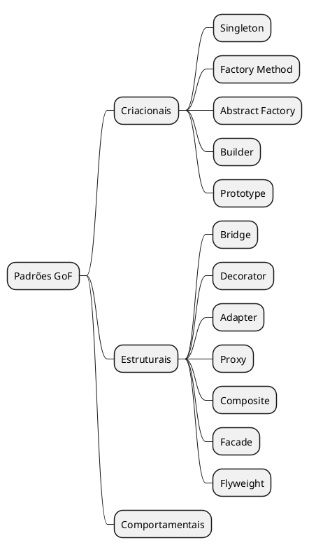
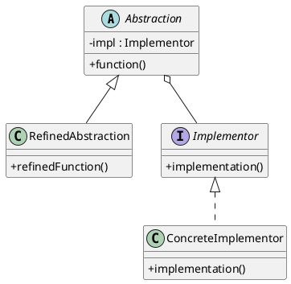
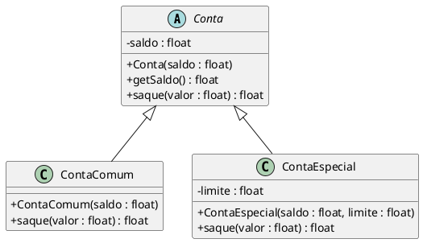
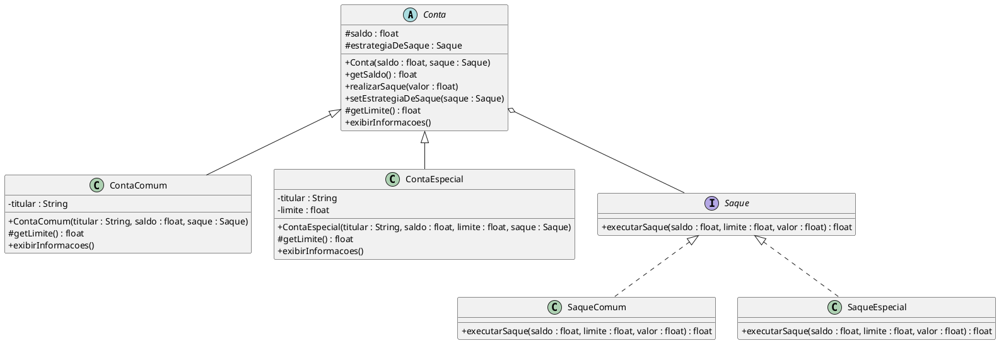
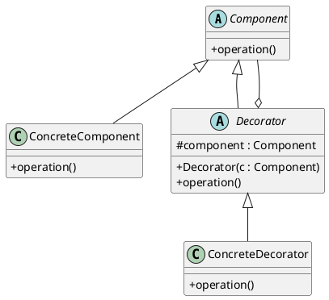
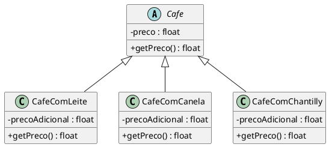
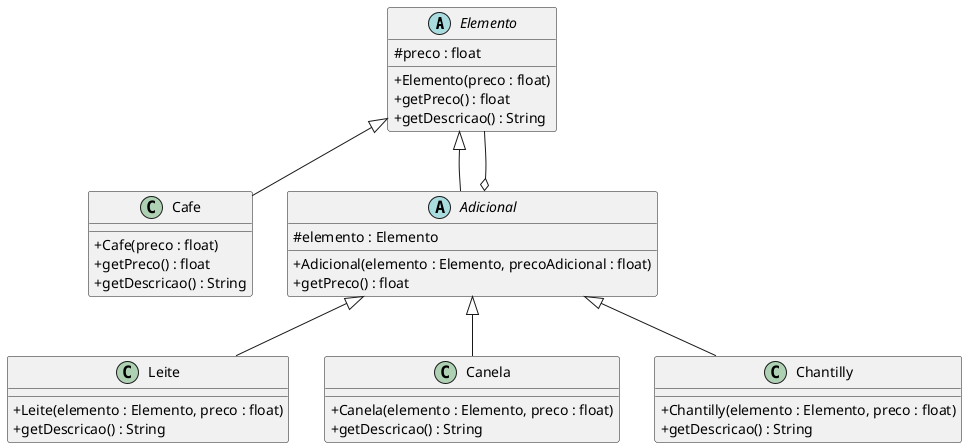

# 📄 Aula 6 - 27-04

# Roteiro de Aula — Padrões GoF Estruturais

**Disciplina:** Desenvolvimento de Sistemas II  
**Aula:** 6

---

## ABERTURA

Na aula passada fechamos o bloco dos padrões **criacionais**: Singleton, Factory Method e Abstract Factory. Esses padrões respondem a uma pergunta central — *como* criar objetos de forma controlada e flexível.

Agora vamos entrar em outro bloco: os padrões **estruturais**. A pergunta que orienta esse bloco é diferente: *como organizar* classes e objetos para que o sistema seja mais flexível e fácil de manter?

Mapa da família GoF para situar onde estamos:



São **sete** padrões estruturais. Hoje vamos fundo em dois deles: **Bridge** e **Decorator**. Os demais serão abordados nas próximas aulas.

---

## BLOCO 1 — PADRÃO BRIDGE

### O problema

Imaginem o seguinte cenário: vocês têm uma hierarquia de classes que modela um conceito. Em determinado momento, percebem que essa hierarquia precisa variar em duas dimensões independentes ao mesmo tempo. O que acontece?

A hierarquia explode.

**Pergunta para a turma:** se eu tenho 3 formas de abstração e 3 formas de implementação, quantas classes eu precisaria se misturar tudo numa hierarquia só?

> Resposta: 9. E se virar 4 x 4? 16. E por aí vai — cresce na multiplicação, não na soma.

**Definição do problema:**  
Como separar uma abstração de sua implementação, de modo que as duas possam variar de forma independente?

**Solução do Bridge:**  
Dividir a hierarquia em duas. Uma representa a abstração. A outra representa a implementação. As duas se comunicam por meio de uma referência — a "ponte".

### Estrutura do padrão



Papéis:

- **Abstraction**: define a interface da abstração e mantém uma referência para o Implementor.
- **RefinedAbstraction**: expande a interface da abstração sem tocar na implementação.
- **Implementor**: define o contrato para as classes de implementação.
- **ConcreteImplementor**: implementa o comportamento concreto.

A chave: a `Abstraction` **delega** para o `Implementor`. Ela não herda — ela **usa**. Esse é o bridge.

---

### Exemplo do mundo real: contas bancárias

**Contexto:** um banco tem dois tipos de conta, `ContaComum` e `ContaEspecial`. A conta especial tem limite de crédito. Ambas realizam saques, mas as regras de saque podem mudar de forma independente dos tipos de conta.

**Primeira modelagem (sem Bridge):**



**Problema:** se a regra de saque mudar — por exemplo, uma nova cobrança de taxa — todas as subclasses precisam ser alteradas. E se surgir um terceiro tipo de conta? Ou uma quarta regra de saque?

**Modelagem com Bridge — separando as duas hierarquias:**



Agora as regras de saque estão isoladas. Posso trocar, adicionar ou modificar o comportamento de saque sem tocar nas classes de conta — e vice-versa. Uma nova regra de saque (com taxa, por exemplo) é uma nova classe que implementa `Saque`, sem alterar nada que já existe.

---

### Implementação

> Abrir o projeto na IDE. Criar o pacote `bridge`. Construir os arquivos na ordem abaixo, explicando cada decisão antes de digitar.

**Ordem de criação sugerida:**
1. `Saque.java` — interface (lado da implementação)
2. `SaqueComum.java` — regra sem limite
3. `SaqueEspecial.java` — regra com limite de crédito
4. `Conta.java` — classe abstrata com a "ponte"
5. `ContaComum.java` — abstração refinada 1
6. `ContaEspecial.java` — abstração refinada 2
7. `TesteBridge.java` — executar e discutir cada teste

---

#### `Saque.java` — A interface do lado da implementação

```java
package bridge;

public interface Saque {

    /**
     * Executa a operação de saque.
     *
     * @param saldo  saldo atual da conta antes do saque
     * @param limite limite de crédito disponível (0 para contas sem limite)
     * @param valor  valor solicitado para saque
     * @return novo saldo após o saque, ou o saldo original se o saque for negado
     */
    float executarSaque(float saldo, float limite, float valor);
}
```

---

#### `SaqueComum.java` — Regra sem limite de crédito

```java
package bridge;

public class SaqueComum implements Saque {

    @Override
    public float executarSaque(float saldo, float limite, float valor) {
        // Regra de negócio: não permite saldo negativo
        if (valor > saldo) {
            System.out.println("[SaqueComum] Saque NEGADO. "
                    + "Valor solicitado: R$" + valor
                    + " | Saldo disponível: R$" + saldo);
            return saldo; // saldo permanece inalterado
        }
        float novoSaldo = saldo - valor;
        System.out.println("[SaqueComum] Saque APROVADO. "
                + "Valor: R$" + valor
                + " | Saldo anterior: R$" + saldo
                + " | Novo saldo: R$" + novoSaldo);
        return novoSaldo;
    }
}
```

---

#### `SaqueEspecial.java` — Regra com limite de crédito

```java
package bridge;

public class SaqueEspecial implements Saque {

    @Override
    public float executarSaque(float saldo, float limite, float valor) {
        // Regra de negócio: pode usar até saldo + limite
        float totalDisponivel = saldo + limite;

        if (valor > totalDisponivel) {
            System.out.println("[SaqueEspecial] Saque NEGADO. "
                    + "Valor solicitado: R$" + valor
                    + " | Total disponível (saldo + limite): R$" + totalDisponivel);
            return saldo;
        }
        float novoSaldo = saldo - valor;
        System.out.println("[SaqueEspecial] Saque APROVADO. "
                + "Valor: R$" + valor
                + " | Saldo anterior: R$" + saldo
                + " | Novo saldo: R$" + novoSaldo
                + (novoSaldo < 0 ? " (usando limite de crédito)" : ""));
        return novoSaldo;
    }
}
```

---

#### `Conta.java` — A abstração com a ponte

```java
package bridge;

public abstract class Conta {

    protected float saldo;

    // A "ponte": referência para o lado da implementação.
    // Pode ser trocada em tempo de execução sem alterar esta classe.
    protected Saque estrategiaDeSaque;

    public Conta(float saldoInicial, Saque estrategiaDeSaque) {
        this.saldo = saldoInicial;
        this.estrategiaDeSaque = estrategiaDeSaque;
    }

    public float getSaldo() {
        return saldo;
    }

    /**
     * Permite trocar a estratégia de saque em tempo de execução.
     * Este é um dos grandes benefícios do Bridge.
     */
    public void setEstrategiaDeSaque(Saque estrategiaDeSaque) {
        this.estrategiaDeSaque = estrategiaDeSaque;
    }

    /**
     * Delega a execução do saque para a implementação associada.
     * A Conta não precisa saber as regras — ela apenas coordena.
     */
    public void realizarSaque(float valor) {
        // Delegação: a conta passa os dados, a estratégia decide o que fazer
        this.saldo = estrategiaDeSaque.executarSaque(this.saldo, getLimite(), valor);
    }

    /**
     * Cada subclasse define seu próprio limite.
     * ContaComum retorna 0; ContaEspecial retorna o limite configurado.
     */
    protected abstract float getLimite();

    public abstract void exibirInformacoes();
}
```

> **Ponto para destacar:** o método `realizarSaque` não tem nenhuma lógica de negócio — ele apenas repassa os dados para `estrategiaDeSaque`. É a delegação em ação. Qualquer mudança nas regras de saque fica contida nos implementors, sem que `Conta` precise ser reaberta.

---

#### `ContaComum.java`

```java
package bridge;

public class ContaComum extends Conta {

    private String titular;

    public ContaComum(String titular, float saldoInicial, Saque estrategiaDeSaque) {
        super(saldoInicial, estrategiaDeSaque);
        this.titular = titular;
    }

    @Override
    protected float getLimite() {
        // Conta comum não possui limite de crédito
        return 0f;
    }

    @Override
    public void exibirInformacoes() {
        System.out.println("=== Conta Comum ===");
        System.out.println("Titular : " + titular);
        System.out.println("Saldo   : R$" + saldo);
        System.out.println("Limite  : não possui");
    }
}
```

---

#### `ContaEspecial.java`

```java
package bridge;

public class ContaEspecial extends Conta {

    private String titular;
    private float limite;

    public ContaEspecial(String titular, float saldoInicial,
                         float limite, Saque estrategiaDeSaque) {
        super(saldoInicial, estrategiaDeSaque);
        this.titular = titular;
        this.limite = limite;
    }

    @Override
    protected float getLimite() {
        return limite;
    }

    @Override
    public void exibirInformacoes() {
        System.out.println("=== Conta Especial ===");
        System.out.println("Titular : " + titular);
        System.out.println("Saldo   : R$" + saldo);
        System.out.println("Limite  : R$" + limite);
    }
}
```

---

#### `TesteBridge.java`

```java
package bridge;

public class TesteBridge {

    public static void main(String[] args) {

        // --------------------------------------------------
        // TESTE 1: Conta Comum — saque dentro e fora do saldo
        // --------------------------------------------------
        System.out.println("====================================");
        System.out.println(" TESTE 1 — Conta Comum, saldo insuficiente");
        System.out.println("====================================");

        Conta contaComum = new ContaComum("Ana Lima", 500f, new SaqueComum());
        contaComum.exibirInformacoes();
        System.out.println();

        contaComum.realizarSaque(300f);  // aprovado: saldo passa para 200
        contaComum.realizarSaque(250f);  // negado: saldo restante é 200
        System.out.println();
        contaComum.exibirInformacoes();

        System.out.println();

        // --------------------------------------------------
        // TESTE 2: Conta Especial usando o limite de crédito
        // --------------------------------------------------
        System.out.println("====================================");
        System.out.println(" TESTE 2 — Conta Especial com limite");
        System.out.println("====================================");

        Conta contaEspecial = new ContaEspecial("Bruno Costa", 200f, 1000f, new SaqueEspecial());
        contaEspecial.exibirInformacoes();
        System.out.println();

        contaEspecial.realizarSaque(150f);   // usa saldo: 200 - 150 = 50
        contaEspecial.realizarSaque(800f);   // usa saldo restante + limite: 50 + 1000 = 1050 disponível
        contaEspecial.realizarSaque(500f);   // negado: limite consumido
        System.out.println();
        contaEspecial.exibirInformacoes();

        System.out.println();

        // --------------------------------------------------
        // TESTE 3: Troca de estratégia em tempo de execução
        // Aqui está o poder do Bridge: trocar a implementação
        // sem modificar nenhuma classe existente.
        // --------------------------------------------------
        System.out.println("====================================");
        System.out.println(" TESTE 3 — Troca de estratégia em tempo de execução");
        System.out.println("====================================");

        // Começa com SaqueComum — sem limite
        Conta contaUpgradada = new ContaEspecial("Carla Souza", 300f, 500f, new SaqueComum());
        contaUpgradada.exibirInformacoes();
        System.out.println();

        contaUpgradada.realizarSaque(400f); // negado: SaqueComum não usa limite

        System.out.println("\n[Sistema] Cliente fez upgrade. Trocando estratégia de saque...\n");

        // Troca apenas a estratégia — a conta e seus dados continuam intactos
        contaUpgradada.setEstrategiaDeSaque(new SaqueEspecial());

        contaUpgradada.realizarSaque(400f); // aprovado agora: SaqueEspecial usa o limite
        contaUpgradada.exibirInformacoes();

        System.out.println();

        // --------------------------------------------------
        // TESTE 4: Nova regra de saque SEM alterar nenhuma classe existente
        // Princípio OCP: aberto para extensão, fechado para modificação.
        // --------------------------------------------------
        System.out.println("====================================");
        System.out.println(" TESTE 4 — Nova regra: Saque com taxa");
        System.out.println(" (sem alterar nenhuma classe existente)");
        System.out.println("====================================");

        // Em produção, seria uma nova classe SaqueComTaxa.java
        Saque saqueComTaxa = new Saque() {
            private static final float TAXA = 0.02f; // 2% de taxa por saque

            @Override
            public float executarSaque(float saldo, float limite, float valor) {
                float valorComTaxa = valor * (1 + TAXA);
                if (valorComTaxa > saldo) {
                    System.out.println("[SaqueComTaxa] Saque NEGADO. "
                            + "Valor com taxa (2%): R$" + valorComTaxa
                            + " | Saldo: R$" + saldo);
                    return saldo;
                }
                float novoSaldo = saldo - valorComTaxa;
                System.out.println("[SaqueComTaxa] Saque APROVADO. "
                        + "Valor: R$" + valor
                        + " | Taxa (2%): R$" + (valor * TAXA)
                        + " | Total debitado: R$" + valorComTaxa
                        + " | Novo saldo: R$" + novoSaldo);
                return novoSaldo;
            }
        };

        Conta contaComTaxa = new ContaComum("Daniel Farias", 1000f, saqueComTaxa);
        contaComTaxa.exibirInformacoes();
        System.out.println();

        contaComTaxa.realizarSaque(500f);
        contaComTaxa.realizarSaque(600f); // negado após o débito anterior com taxa
        System.out.println();
        contaComTaxa.exibirInformacoes();
    }
}
```

> **Saída esperada do Teste 1:**
> ```
> [SaqueComum] Saque APROVADO. Valor: R$300.0 | Saldo anterior: R$500.0 | Novo saldo: R$200.0
> [SaqueComum] Saque NEGADO. Valor solicitado: R$250.0 | Saldo disponível: R$200.0
> ```

> **Ponto para destacar:** a nova regra de taxa foi adicionada sem tocar em `Conta`, `ContaComum`, `SaqueComum` ou qualquer outra classe. Apenas uma nova implementação de `Saque`. Esse é o princípio Aberto/Fechado em prática.

### Pontos de fixação — Bridge

O padrão Bridge torna projetos mais reusáveis e flexíveis porque divide uma hierarquia que seria monolítica em duas hierarquias menores com responsabilidades claras. O benefício cresce conforme o sistema evolui: cada novo tipo de conta e cada nova regra de saque são adicionados de forma independente, sem causar modificações em cascata.

> Para aprofundamento: https://refactoring.guru/design-patterns/bridge

---

## BLOCO 2 — PADRÃO DECORATOR

### O problema

Agora um cenário diferente. Vocês precisam adicionar funcionalidades a um objeto em tempo de execução — de forma dinâmica, sem saber em tempo de compilação quais combinações serão necessárias.

A resposta mais imediata seria: subclasse para cada combinação.

**Pergunta para a turma:** qual é o problema de resolver isso só com herança?

> Resposta: subclasses são definidas em tempo de compilação. Não é possível combiná-las dinamicamente. E o número de subclasses cresce de forma combinatória — para N adicionais, são 2^N combinações possíveis.

**Definição do problema:**  
Como adicionar funcionalidades dinamicamente a um objeto sem usar herança?

**Solução do Decorator:**  
Encapsule cada funcionalidade em uma classe de "decoração". As decorações são empilhadas umas sobre as outras até chegar ao objeto que será decorado. É uma inversão de responsabilidade: não é o componente que conhece suas decorações — são as decorações que conhecem o componente.

### Estrutura do padrão



Papéis:

- **Component**: tipo comum para o componente concreto e para todos os decoradores.
- **ConcreteComponent**: o objeto que será decorado — o produto base.
- **Decorator**: classe abstrata que estende `Component` e mantém referência para outro `Component`.
- **ConcreteDecorator**: adiciona comportamento antes ou depois de delegar para o componente interno.

---

### Exemplo do mundo real: cafeteria

**Contexto:** uma cafeteria vende café que pode vir com leite, canela e chantilly, em qualquer combinação. Cada item tem um preço individual.

**Primeira tentativa — herança simples:**



**Problema:** café com leite *e* canela exige `CafeComLeiteECanela`. Com três adicionais, são 7 combinações possíveis. Com quatro, são 15. Cada novo adicional dobra o número de subclasses necessárias.

**Modelagem com Decorator:**



---

### Implementação

**Ordem de criação sugerida:**
1. `Elemento.java` — componente abstrato
2. `Cafe.java` — componente concreto (produto base)
3. `Adicional.java` — decorator abstrato
4. `Leite.java`, `Canela.java`, `Chantilly.java` — decorators concretos
5. `TesteDecorator.java` — executar pedido por pedido

---

#### `Elemento.java` — Tipo comum entre produto e decoradores

```java
package decorator;

public abstract class Elemento {

    protected float preco;

    public Elemento(float preco) {
        this.preco = preco;
    }

    /**
     * Cada subclasse calcula seu preço de forma diferente.
     * O Café retorna apenas seu próprio preço.
     * Os Adicionais somam seu preço ao do elemento que decoram.
     */
    public abstract float getPreco();

    /**
     * Retorna uma descrição textual do que foi pedido.
     * Útil para imprimir o "recibo" do pedido
     */
    public abstract String getDescricao();
}
```

---

#### `Cafe.java` — O componente concreto (produto base)

```java
package decorator;

public class Cafe extends Elemento {

    public Cafe(float preco) {
        super(preco);
    }

    @Override
    public float getPreco() {
        // O café retorna apenas seu próprio preço, sem adicionais
        return preco;
    }

    @Override
    public String getDescricao() {
        return "Café";
    }
}
```

---

#### `Adicional.java` — O decorator abstrato

```java
package decorator;

public abstract class Adicional extends Elemento {

    // Referência para o elemento que está sendo "decorado".
    // Pode ser um Café (base) ou outro Adicional (empilhamento).
    // O tipo é Elemento — isso é o que permite composição livre.
    protected Elemento elemento;

    public Adicional(Elemento elemento, float precoAdicional) {
        super(precoAdicional);
        this.elemento = elemento;
    }

    @Override
    public float getPreco() {
        // Soma o preço deste adicional ao preço do elemento interno.
        // A chamada é recursiva: cada camada adiciona seu próprio preço.
        return elemento.getPreco() + preco;
    }
}
```

> **Ponto para destacar:** o `getPreco()` de `Adicional` não sabe quantas camadas existem abaixo dele. Cada camada delega para a próxima. O Java resolve recursivamente até chegar no `Cafe`, que é a base da cadeia.

---

#### `Leite.java`, `Canela.java`, `Chantilly.java`

```java
package decorator;

public class Leite extends Adicional {

    public Leite(Elemento elemento, float precoLeite) {
        super(elemento, precoLeite);
    }

    @Override
    public String getDescricao() {
        // Concatena a descrição do elemento anterior com a própria
        return elemento.getDescricao() + " + Leite";
    }
}
```

```java
package decorator;

public class Canela extends Adicional {

    public Canela(Elemento elemento, float precoCanela) {
        super(elemento, precoCanela);
    }

    @Override
    public String getDescricao() {
        return elemento.getDescricao() + " + Canela";
    }
}
```

```java
package decorator;

public class Chantilly extends Adicional {

    public Chantilly(Elemento elemento, float precoChantilly) {
        super(elemento, precoChantilly);
    }

    @Override
    public String getDescricao() {
        return elemento.getDescricao() + " + Chantilly";
    }
}
```

---

#### `TesteDecorator.java` — Executar pedido por pedido

```java
package decorator;

public class TesteDecorator {

    // Método auxiliar para imprimir o "recibo" de um pedido
    private static void imprimirPedido(String numeroPedido, Elemento pedido) {
        System.out.println("----------------------------------");
        System.out.println("Pedido #" + numeroPedido);
        System.out.println("Itens   : " + pedido.getDescricao());
        System.out.printf( "Total   : R$%.2f%n", pedido.getPreco());
        System.out.println("----------------------------------");
    }

    public static void main(String[] args) {

        // Tabela de preços do estabelecimento
        final float PRECO_CAFE      = 4.00f;
        final float PRECO_LEITE     = 1.50f;
        final float PRECO_CANELA    = 0.75f;
        final float PRECO_CHANTILLY = 4.55f;

        System.out.println("======================================");
        System.out.println("        CAFETERIA MACKENZIE");
        System.out.println("======================================");
        System.out.println();

        // --------------------------------------------------
        // PEDIDO 1: Café puro
        // Mostra que o componente base funciona sozinho.
        // --------------------------------------------------
        Elemento pedido1 = new Cafe(PRECO_CAFE);
        imprimirPedido("001 — Café puro", pedido1);
        // Esperado: R$4,00

        System.out.println();

        // --------------------------------------------------
        // PEDIDO 2: Café com leite
        // Uma camada de decoração sobre o componente base.
        // --------------------------------------------------
        Elemento pedido2 = new Leite(
                               new Cafe(PRECO_CAFE),
                           PRECO_LEITE);
        imprimirPedido("002 — Café com leite", pedido2);
        // Esperado: R$5,50

        System.out.println();

        // --------------------------------------------------
        // PEDIDO 3: Café com leite e chantilly
        // Duas camadas de decoração.
        // Leitura de fora para dentro: Chantilly -> Leite -> Café
        // Cálculo: 4,00 + 1,50 + 4,55 = 10,05
        // --------------------------------------------------
        Elemento pedido3 = new Chantilly(
                               new Leite(
                                   new Cafe(PRECO_CAFE),
                               PRECO_LEITE),
                           PRECO_CHANTILLY);
        imprimirPedido("003 — Café com leite e chantilly", pedido3);
        // Esperado: R$10,05

        System.out.println();

        // --------------------------------------------------
        // PEDIDO 4: Café com todos os adicionais
        // --------------------------------------------------
        Elemento pedido4 = new Chantilly(
                               new Canela(
                                   new Leite(
                                       new Cafe(PRECO_CAFE),
                                   PRECO_LEITE),
                               PRECO_CANELA),
                           PRECO_CHANTILLY);
        imprimirPedido("004 — Café completo", pedido4);
        // Esperado: R$10,80

        System.out.println();

        // --------------------------------------------------
        // PEDIDO 5: Café com leite DUPLO
        // O mesmo decorator pode ser aplicado mais de uma vez!
        // Isso é impossível com herança pura — não existe
        // subclasse "CafeComDoisLeites". Com Decorator, é trivial.
        // --------------------------------------------------
        Elemento pedido5 = new Leite(
                               new Leite(
                                   new Cafe(PRECO_CAFE),
                               PRECO_LEITE),
                           PRECO_LEITE);
        imprimirPedido("005 — Café com leite duplo", pedido5);
        // Esperado: R$7,00

        System.out.println();

        // --------------------------------------------------
        // PEDIDO 6: Composição dinâmica em tempo de execução
        // A decisão de quais adicionais incluir pode ser feita
        // durante a execução — impossível com herança.
        // --------------------------------------------------
        System.out.println("======================================");
        System.out.println(" PEDIDO 6 — Composição dinâmica");
        System.out.println("======================================");

        // Simula preferências do cliente (poderiam vir de um formulário,
        // banco de dados, entrada do usuário etc.)
        boolean clienteQuerLeite     = true;
        boolean clienteQuerCanela    = false;
        boolean clienteQuerChantilly = true;

        // Começa sempre com o componente base
        Elemento pedidoDinamico = new Cafe(PRECO_CAFE);

        // Cada adicional é "empilhado" conforme a preferência
        if (clienteQuerLeite)     pedidoDinamico = new Leite(pedidoDinamico, PRECO_LEITE);
        if (clienteQuerCanela)    pedidoDinamico = new Canela(pedidoDinamico, PRECO_CANELA);
        if (clienteQuerChantilly) pedidoDinamico = new Chantilly(pedidoDinamico, PRECO_CHANTILLY);

        imprimirPedido("006 — Pedido dinâmico", pedidoDinamico);
        // Esperado com leite + chantilly: R$10,05

        System.out.println();

        // --------------------------------------------------
        // RESUMO para fechar a demonstração
        // --------------------------------------------------
        System.out.println("======================================");
        System.out.println(" POR QUE NÃO USAR SÓ HERANÇA?");
        System.out.println("======================================");
        System.out.println("Com 3 adicionais: 2^3 =  8 subclasses necessárias");
        System.out.println("Com 4 adicionais: 2^4 = 16 subclasses necessárias");
        System.out.println("Com 5 adicionais: 2^5 = 32 subclasses necessárias");
        System.out.println();
        System.out.println("Com Decorator: qualquer combinação,");
        System.out.println("sem nenhuma classe nova.");
    }
}
```

> **Saída esperada do Pedido 3:**
> ```
> ----------------------------------
> Pedido #003 — Café com leite e chantilly
> Itens   : Café + Leite + Chantilly
> Total   : R$10,05
> ----------------------------------
> ```

> **Pontos para destacar:**
> - O Pedido 5 (leite duplo) é impossível de modelar com herança sem criar `CafeComLeiteDuplo`.
> - O Pedido 6 mostra composição dinâmica: a estrutura do objeto é montada em tempo de execução com base em variáveis. Herança não permite isso.
> - O `getPreco()` de `Adicional` é recursivo sem que nenhuma classe saiba quantas camadas existem.

### Comparação: herança vs. Decorator

| Aspecto | Herança | Decorator |
|---|---|---|
| Combinações | Explosão de subclasses (2^N) | Composição dinâmica |
| Momento de definição | Compilação | Execução |
| Acoplamento | Alto (hierarquia rígida) | Baixo (por composição) |
| Mesmo decorator duas vezes | Impossível | Trivial (Pedido 5) |
| Extensibilidade | Nova subclasse por combinação | Nova classe por adicional |

### Pontos de fixação — Decorator

O Decorator é a resposta padrão GoF para o princípio **"prefira composição em vez de herança"**. Sempre que você se pegar criando subclasses apenas para adicionar pequenas variações de comportamento, o Decorator é um candidato forte. O ponto central é a inversão de responsabilidade: não é o componente que conhece seus decoradores — são os decoradores que conhecem o componente.

> Para aprofundamento: https://refactoring.guru/design-patterns/decorator

---

## FECHAMENTO

Para recapitular o que vimos hoje:

**Bridge** — separa abstração de implementação em duas hierarquias independentes, conectadas por delegação. Use quando ambos os lados precisam variar de forma independente e você quer evitar a explosão multiplicativa de subclasses.

**Decorator** — adiciona comportamentos a objetos de forma dinâmica, por composição em cadeia. Use quando o número de combinações de funcionalidades é grande, imprevisível ou precisa ser definido em tempo de execução.

Os dois padrões compartilham um princípio em comum: **favorecer composição em vez de herança**.
